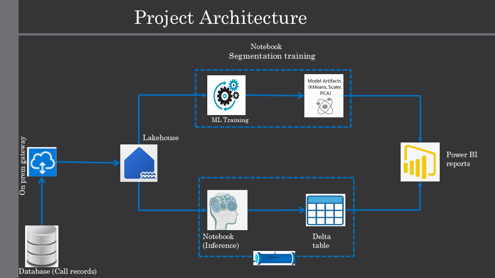
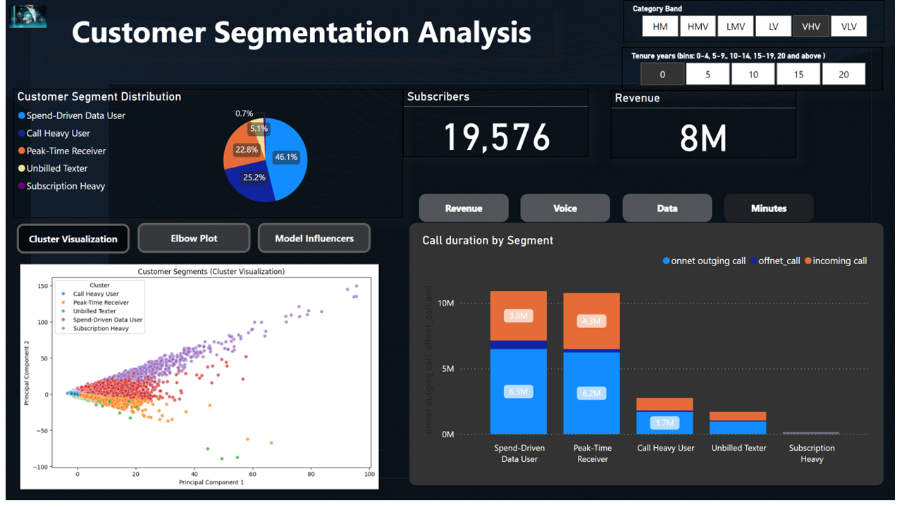

# 🔍 Intelligent Customer Segmentation from Telecom Call History Using Microsoft Fabric
A scalable customer segmentation pipeline using real-world telecom call history data — all developed, deployed, and visualized end-to-end in Microsoft Fabric.
Leverage the power of data to unlock hidden customer insights and drive revenue with intelligent segmentation.

## 🚀 Project Summary

This project uses machine learning and Microsoft Fabric's end-to-end data platform to segment telecom customers based on detailed call history behavior. By analyzing usage trends, recharge patterns, and behavioral KPIs, we identify high-impact segments like **Spend-Driven Data User**, **Call Heavy User**,**Peak-Time Receiver**, **Unbilled Texter** and **Subscription Heavy**. This empowers marketing teams to personalize engagement and optimize revenue strategies.

---

## 🎯 Business Goals

- Identify and group customers by real usage behavior.
- Discover patterns in recharge frequency, voice/data usage, and revenue.
- Drive marketing strategies through actionable customer insights.
- Enable retention campaigns through data-driven segmentation.

---

## 🏗️ Solution Architecture



> Full workflow powered by Microsoft Fabric — from on-prem ingestion to Power BI visualization.

---

## 🧪 ML Workflow Summary

**Training Pipeline**
- Ingest raw data via On-Prem Gateway → Data Factory → Lakehouse
- Preprocess and engineer features in Fabric Notebook
- Standardize data & reduce dimensions via PCA
- Auto-select optimal number of clusters (k) using Elbow Method
- Apply KMeans clustering with dynamic k
- Extract top 3 features per cluster to label segments (e.g., *High Spender*)

**Inference Pipeline**
- Reuse saved scaler, PCA, and model for new data
- Predict cluster, map to segment labels
- Store output as Delta Table for Power BI

---

## 📊 Key Deliverables

| Deliverable                        | Location                             |
|-----------------------------------|--------------------------------------|
| Trained ML Models                 | `model_artifacts/`                   |
| Segmentation Output with Labels   | `output_data/segmentation_output_inference.csv`|
| Cluster Feature Mappings          | `output_data/cluster_feature_mapping.csv` |
| Power BI Report                   | `reports/PowerBI_Dashboard` |
| Architecture Diagram              | `docs/architecture.png`     |

---

## 🛠️ Tools & Technologies

| Category             | Tools                                      |
|----------------------|---------------------------------------------|
| Data Ingestion        | Microsoft Fabric Data Factory               |
| Storage               | Fabric Lakehouse                            |
| Data Science          | Fabric Notebooks (Python, sklearn, seaborn) |
| Model Deployment      | joblib, Delta Table                         |
| Visualization         | Power BI                                    |
| Orchestration         | Microsoft Fabric Pipelines                  |

---

## Visualization


📈 Insights Generated
Identified 3–5 customer segments using unsupervised learning.

Segment examples:

🟢 Spend-Driven Data User

🟡 Call Heavy User

🔵 Peak-Time Receiver

Key behavioral KPIs:

Voice Spent

Total revenue Amount

Call Duration

---
## 📦 Setup Instructions

1. Clone this repo:
   ```bash
   git clone https://github.com/frankadane/Customer-Segmentation-in-Telecom-with-Microsoft-Fabric.git
Install Python dependencies:

pip install -r requirements.txt     

Open notebooks in Microsoft Fabric or Jupyter:

notebooks/segmentation_training.ipynb

notebooks/inference_pipeline.ipynb


